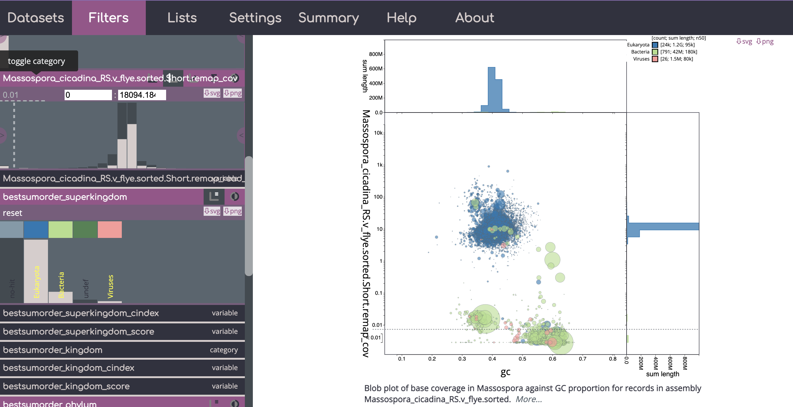

# Using BlobTools2 to identify contamination in eukaryotic genomes or bins

https://blobtoolkit.genomehubs.org/blobtools2/

The BlobToolKit can be installed using conda (see: https://blobtoolkit.genomehubs.org/install/) and is already installed on the HPCC. The BlobToolKit has a "Viewer" that is needed to look at the results and interactively determine what cut-offs you would like to use to call a contig "contamination".  

* <b>Pros: </b>faster than running bacterial binning algorithms in some cases, can be run on contigs of all sizes, viewer images can be exported as svg files, can incorporate BUSCO information as part of interactive viewer 
* <b> Cons:</b> searches against databases can be slow for larger genomes, does require manual interactive viewing of the viewer, does not automatically output predicted contaminants

Several tutorials are available here: https://blobtoolkit.genomehubs.org/btk-viewer/viewer-tutorials/

## The Pipeline

First - decide whether you will use the Viewer on your local machine (this is what I do) or on the HPCC ported to your local machine (for instructions see: https://blobtoolkit.genomehubs.org/blobtools2/blobtools2-tutorials/opening-a-dataset-in-the-viewer/). If the first option, then you will need install via conda and clone the source code to your local machine (see: https://blobtoolkit.genomehubs.org/install/).

#### NOTE: While blobtools2 is installed on the cluster - these scripts all are currently written and tested using a local conda install of blobtools and blobtools code - if you try with the HPCC install & it works then please update the SOP accordingly  

### Step 1: Download the data 

For this pipeline you need (1) an assembly and (2) some reads. Here I give an example of how you might download reads from SRA to use for this.

Script: `00_download.sh`

```bash
#!/usr/bin/bash
#SBATCH -p intel -N 1 -n 2 --mem 4gb
#SBATCH -J Blob_download

module load aspera

#change to your aspera key
KEY=/PATH/TO/YOUR/private.openssh.pub

#download reads from NCBI
#download.txt is a file where each line is an SRA asscession number
/bigdata/stajichlab/shared/bin/sra_download.pl --ascp --id $ASPERAKEY download.txt
```

### Step 2: Get taxonomic information 

You can use blast and/or diamond to map against blobtools formatted databases to incorportate taxonomy into your blobtools views. The databases that you need are already installed on the HPCC. 

#### Diamond

Script: `01_blobtools_diamond.sh`

```bash
#!/bin/bash
##
#SBATCH -p intel,batch
#SBATCH -o logs/01_diamond.log
#SBATCH -e logs/01_diamond.log
#SBATCH --nodes=1
#SBATCH --ntasks=24 # Number of cores
#SBATCH --mem=96G # Memory pool 
#SBATCH -J Blob_diamond

module unload miniconda2
module load miniconda3
module load diamond

#db that is on cluster
DB=/srv/projects/db/blobPlotDB/2021_04/reference_proteomes.dmnd


#change to your options
ASMDIR=data
CPU=24
COV=coverage
TAXFOLDER=taxonomy
OUTPUT=blobtools
SAMPFILE=$ASMDIR/samples.txt
#tab-delim file with PREFIX and then the assembly names if you have multiple assemblies
#and also the prefix for the FWD and REV read sets

IFS=
tail -n +2 $SAMPFILE | sed -n ${N}p | while read PREFIX FWD REV
do 
	ASSEMBLY=$(realpath ${ASMDIR}/$PREFIX.fasta)

	diamond blastx \
	--query $ASSEMBLY \
	--db $DB -c1 --tmpdir /scratch \
	--outfmt 6 qseqid staxids bitscore qseqid sseqid pident length mismatch gapopen qstart qend sstart send evalue bitscore\
	--max-target-seqs 1 \
	--evalue 1e-25 --threads $CPU \
	--out $OUTPUT/$TAXFOLDER/$PREFIX.diamond.tab

done
```

#### BLAST

Script: `02_blobtools_blast.sh`

```bash
#!/bin/bash
##
#SBATCH -p intel,batch
#SBATCH -o logs/02_blast.log.txt
#SBATCH -e logs/02_blast.log.txt
#SBATCH --nodes=1
#SBATCH --ntasks=24 # Number of cores
#SBATCH --mem=64G # Memory pool for all cores (see also --mem-per-cpu)
#SBATCH -J Blob_blast


module unload miniconda2
module load miniconda3
module load ncbi-blast


#DB is on the cluster
DB=/srv/projects/db/NCBI/preformatted/20220121/nt


ASMDIR=data
CPU=24
COV=coverage

TAXFOLDER=taxonomy
OUTPUT=blobtools
SAMPFILE=$ASMDIR/samples.txt
#tab-delim file with PREFIX and then the assembly names if you have multiple assemblies
#and also the prefix for the FWD and REV read sets


IFS=
tail -n +2 $SAMPFILE | sed -n ${N}p | while read PREFIX 
do 
	ASSEMBLY=$(realpath ${ASMDIR}/$PREFIX.fasta)

blastn \
 -query $ASSEMBLY \
 -db $DB \
 -outfmt "6 qseqid staxids bitscore std" \
 -max_target_seqs 10 \
 -max_hsps 1 -num_threads $CPU \
 -evalue 1e-25 -out $OUTPUT/$TAXFOLDER/$PREFIX.nt.blastn.tab


done 
```

### Step 3: Get coverage information

Blobtools also needs coverage information - so we need to generate this for our assembly.

Script: `03_blobtools_coverage.sh`

```bash
#!/bin/bash
##
#SBATCH -p intel,batch
#SBATCH -o logs/03_cov.log
#SBATCH -e logs/03_cov.log
#SBATCH --nodes=1
#SBATCH --ntasks=24 # Number of cores
#SBATCH --mem=64G # Memory pool for all cores (see also --mem-per-cpu)
#SBATCH -J Blob_coverage

module unload miniconda2
module load bwa
module load samtools/1.11
module load bedtools
module load miniconda3

ASMDIR=data
CPU=24
COV=coverage
TAXFOLDER=taxonomy
OUTPUT=blobtools

SAMPFILE=data/samples.txt
#tab-delim file with PREFIX and then the assembly names if you have multiple assemblies
#and also the prefix for the FWD and REV read sets

IFS=
tail -n +2 $SAMPFILE | sed -n ${N}p | while read PREFIX FWD REV
do
	
	ASSEMBLY=${ASMDIR}/$PREFIX.fasta
	
	bwa index $ASSEMBLY
	

	BAM=${OUTPUT}/${COV}/$PREFIX.remap.bam
	FWD=${ASMDIR}/${FWD}.fastq.gz
	REV=${ASMDIR}/${REV}.fastq.gz
	
	bwa mem -t $CPU $ASSEMBLY $FWD $REV | samtools sort --threads $CPU -T /scratch -O bam -o $BAM
	
	samtools index $BAM

done
```

### Step 4: Create a blobtools object

Combine the coverage and taxonomy information to view in blobtools. If you have run BUSCO you can also import this information too.

Script: `04_blobtools_create.sh`

```bash
#!/usr/bin/bash
#SBATCH -p intel,batch
#SBATCH -o logs/04_blob.create.log
#SBATCH -e logs/04_blob.create.log
#SBATCH --nodes=1
#SBATCH --ntasks=16 # Number of cores
#SBATCH --mem=32G # Memory pool for all cores (see also --mem-per-cpu)
#SBATCH -J Blob2_create


module unload miniconda2
module load miniconda3

module load db-ncbi
module load db-uniprot

#local conda install - use module load instead for HPCC
source activate btk_env

#local install to my bigdata for the sourcecode
export PATH=$PATH:/rhome/cassande/bigdata/software/blobtoolkit/blobtools2

TAXFOLDER=taxonomy
COV=coverage
OUTPUT=blobtools
READDIR=input
ASMDIR=data

SAMPFILE=data/samples.txt

TAXDUMP=/srv/projects/db/blobPlotDB/taxonomy/
#TAXDUMP=/rhome/cassande/bigdata/software/blobtoolkit/taxdump/

IFS=
tail -n +2 $SAMPFILE | sed -n ${N}p | while read PREFIX FWD REV
do
	
	ASSEMBLY=${ASMDIR}/$PREFIX.fasta
	BAM=${OUTPUT}/${COV}/$PREFIX.remap.bam
	PROTTAX=${OUTPUT}/${TAXFOLDER}/$PREFIX.diamond.tab
	BLASTTAX=${OUTPUT}/${TAXFOLDER}/$PREFIX.nt.blastn.tab
	
	#create blob
	blobtools create --fasta $ASSEMBLY --replace ${OUTPUT}/$PREFIX 

	blobtools add --cov $BAM --threads 16 --replace ${OUTPUT}/$PREFIX

	blobtools add --hits $PROTTAX --hits $BLASTTAX --taxrule bestsumorder --taxdump $TAXDUMP --replace ${OUTPUT}/$PREFIX
	
	#if you have BUSCO results you can import the full_summary.tsv for them into blobtools using the add command as well
	#for basic bacterial contamination removal I haven't found this useful, but can be in more complex cases
	#blobtools add --busco $PREFIX.YOURFAVEBUSCOSET.full_summary.tsv

done
```

### Step 5: Interactive viewer 

Tutorials here: https://blobtoolkit.genomehubs.org/btk-viewer/viewer-tutorials/

While theoretically you can have blobtools generate plots via command line use of `blobtools view` - I have not had sucess with this because of dependency issues.

If you are on a Mac you need to have X11 or XQuartz to use the Viewer. If you plan to run the viewer locally - you will need to use `scp` or `rsync` to obtain the output files from the cluster. Remember - you can host the viewer on the HPCC if you want (for instructions see: https://blobtoolkit.genomehubs.org/blobtools2/blobtools2-tutorials/opening-a-dataset-in-the-viewer/). 

To open the viewer interactively - where $PREFIX is the name of output folder you generated previously:

```bash
blobtools view --interactive $PREFIX
```



Example of a blobtools view - you can see there are many contigs with low coverage (< 0.1) that have been flagged as containing segments that mapped to bacteria/viruses here. Also many of these have higher GC content than the the eukaryotic portion of the genome. Note - for blobtools I would use the higher taxonomic levels and not rely on lower level ranks.

After you have looked at your results interactively, you can either download csv/tsvs from the viewer directly of which contigs you would like to filter out or make a list of parameters to use via the command line with the blobtools filter command (more info here: https://blobtoolkit.genomehubs.org/blobtools2/blobtools2-tutorials/filtering-a-dataset/). You can also download svg or png images of the blobtools view with different parameters and fitlers. If you have any trouble downloading the views as images, try switching web browers - I've had sucess with Google Chrome.

An example of how to use the command-line filter options if we want to remove all contigs with coverage < 0.1 or that mapped to bacteria or viral domains:

```bash
SAMPFILE=data/samples.txt
OUTPUT=blobtools
ASMDIR=data

IFS=
tail -n +2 $SAMPFILE | sed -n ${N}p | while read PREFIX FWD REV
do
	ASSEMBLY=${ASMDIR}/$PREFIX.fasta

	blobtools filter \
	--param cov--Min=0.1 \
	--param bestsumorder_domain--Keys=Bacteria,Viruses \
	--fasta $ASSEMBLY \
	${OUTPUT}/$PREFIX
```
