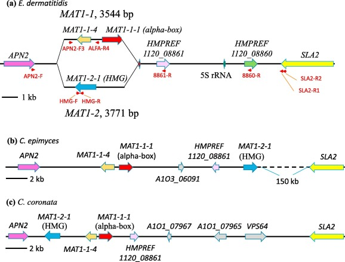

# Using CLINKER to generate visual synteny graphics

I have the MAT loci example to show, but this can work for any loci you want to observe or are interested in. 

Let's say you have a set of genomes and would like to observe the loci, is it missing genes in some? Is it even present in all genomes?

What you need:

Your genome set in amino acid sequences. *.proteins.fa*

Cluster access

module load ncbi-blast+

module load clinker

strains.csv

A GFF3 file for each genome. Make sure the locus ID is the same in the FASTA file and the GFF3 file.

A GBK file for each genome. Make sure the locus ID is the same in the FASTA file and the GBK file. 


## Find the closest evolutionary strain that has good publication history and has the loci studied and available on NCBI.

My question was looking into the MAT loci - specifically for the organism Exophiala dermatitidis. I found a paper indicating the genes and their fasta sequences.

[Paper](https://www.sciencedirect.com/science/article/abs/pii/S1087184518303293)




This paper has the details I was looking for, and pulled out the fasta sequences for each of the genes found in the loci. 
SLA2, Hypothetical protein, MAT 1-1-1, MAT 1-1-4, APN2.

Not all the genes were available and I had to use the NCBI genome browser to pull up the geneIDs. 
The MAT loci is flanked with SLA2 and APN2 proteins so this was the two pieces I pulled, plus anything else in between. 
To confirm exactly what each protein was, I ran BLAST to compare to other similar fungi and confirmed the identity of MAT 1-1-1, MAT 1-1-4 and the hypothetical protein.

## Running BLASTP to pull out the 
Once you have all the Protein Fasta sequences. Save this in your terminal. Make sure your genome sequences are in a pep/ folder.

Make a pipeline folder and create this file.
`00_make_databases.sh`

```bash
#!/bin/bash
#SBATCH --nodes 1 --ntasks 2 --mem 8G -p short --out logs/make_database_%a.log

module load ncbi-blast

# EXPECTED VARIABLES
GENOMEFOLDER=pep
SAMPLES=strains.csv

if [ $SLURM_CPUS_ON_NODE ]; then
 CPU=$SLURM_CPUS_ON_NODE
fi
N=${SLURM_ARRAY_TASK_ID}

if [ ! $N ]; then
 N=$1
 if [ ! $N ]; then 
    echo "Need a number via slurm --array or cmdline"
    exit
 fi
fi

IFS=,
sed -n ${N}p $SAMPLES | while read STRAIN 
do
	makeblastdb -in $GENOMEFOLDER/$STRAIN.proteins.fa  -dbtype prot -out $GENOMEFOLDER/$STRAIN
done
```
This script will go into your pep folder and create index database files for each genome.
Another variable listed here is the SAMPLES=strains.csv - this is a csv file with just your pep file name (no .proteins.fa).
This script will allow you to iteratively go through each line of your csv file and run the makeblastdb line.

Second file to add in your pipeline folder.

`01_runblastp.sh`

```bash
#!/bin/bash
#SBATCH --nodes 1 --ntasks 2 --mem 8G -p short --out logs/blastp_%a.log

module load ncbi-blast

# EXPECTED VARIABLES
GENOMEFOLDER=pep
BLASTP=blastp
mkdir -p $BLASTP
SAMPLES=strains.csv

if [ $SLURM_CPUS_ON_NODE ]; then
 CPU=$SLURM_CPUS_ON_NODE
fi
N=${SLURM_ARRAY_TASK_ID}

if [ ! $N ]; then
 N=$1
 if [ ! $N ]; then 
    echo "Need a number via slurm --array or cmdline"
    exit
 fi
fi

IFS=,
sed -n ${N}p $SAMPLES | while read STRAIN 
do
	blastp -db $GENOMEFOLDER/$STRAIN -query PROTEIN.faa -evalue 1e-5  -outfmt 6 -out $BLASTP/$STRAIN.PROTEIN.tab
done
```

This script will require you to edit the -query portion and add the fasta file of each protein you will be searching for in your search.
Make sure to change the protein name in the -out tab file as well. 
This script will create a blastp folder, and in the folder will be the results of your blast. 
The output will be in blastp header 6 which looks like: qseqid	sseqid	pident	length	mismatch	gapopen	qstart	qend	sstart	send	evalue	bitscore

In the combined excel sheet I pick the highest percentage sequence ID for each strain. 

## Take your Blastp results, combine and visualize in an excel sheet
I like to view my results all on one sheet. I end up creating a file with all the results put together and view them protein by protein. 
Each tab of the excel sheet are different proteins then a final tab will have the combined results

If I want to combine all the blastp results of SLA2 I end up doing:
head  *.SLA2.tab >> E_derm_SLA2.tab* 
then cat E_derm_SLA2.tab and paste this into the excel sheet. 

Now look through each genome blastp result and what the percent identities are and pick your highest value(s)

## Look through GFF3 files and grab the regions 
When you have all the sequence IDs for each protein we'll be looking for their coordinates in the genome as well as their scaffolds.
This is where the GFF3 files will come in handy - and you'll just need grep to help find out the coordiantes.

Type in:
```bash
grep "SEQID" genome.gff3
```

This will pull up all the instances that seqid appears in your GFF3 file. Looking at the results you'll see the coordinates as well as the scaffold the protein is found in.
Take the data and input into your sheet like : HREMP0002 | HREMP_32:3220001-32908823
Complete for all seqIDs to have the entire locus mapped out.
If you're lucky the proteins will all be found in the same scaffold. If not there is still a way to get around this.


## Pulling the gbk region to visualize
Looking at your coordinates for each gene try to grasp regions a little larger than the first protein and the last protein found in the loci. 
Example:
HREMP0002 | HREMP_32:32200540-32208823                     HREMP8733 | HREMP_32:32010388-32088654

HREMP_32:32200500-32008700
I basically took off 50 bp forward and reverse just in case.

Now with this saved region you'll be able to pull out the proper gbk file.
Use these set of lines:

```python
python
from Bio import SeqIO
#index your gbk file as a dictionary
record_dict = SeqIO.index("GCA_000149865.1_genomic.gbk", "genbank") #You'll need to change the gbk file within the "" to what you are working with
#Check that it was indexed
print(record_dict)
#ID your chromosome of interest. This is the same as your contig ID
chrom1 = record_dict['HREMP_32'] #I just saved the scaffold of interest - in this case HREMP_32
#Now we add the regions we want
chrom1_subseq = chrom1[32200500:32008700] #MAKE SURE to change the dash from above to :
#write the output to a new gbk
SeqIO.write(chrom1_subseq, "GCA_000149865.1_genomic_MAT.gbk", "gb")
quit()
```
Alright now you got your updated genbank file!

##What if you have pieces in different scaffolds??
This sucks, but it's a relic of your genome assembly. Make sure you check exaclty which regions you require from both scaffolds. 
You'll be able to stick them together by using the similar script above but with a few modifications. 

```python
python
from Bio import SeqIO
#index your gbk file as a dictionary
record_dict = SeqIO.index("GCA_000149865.1_genomic.gbk", "genbank") #You'll need to change the gbk file within the "" to what you are working with
#Check that it was indexed
print(record_dict)
#ID your chromosome of interest. This is the same as your contig ID
chrom1 = record_dict['HREMP_32'] #I just saved the scaffold of interest - in this case HREMP_32
chrom2 = record_dict['HREMP_35'] #second chromosome region
#Now we add the regions we want
chrom1_subseq = chrom1[32200500:32008700] #MAKE SURE to change the dash from above to :
chrom2_subseq = chrom2[5668420:5668940] 
#Combine the subseqs
chrom12 = chrom1_subseq + chrom2_subseq
#write the output to a new gbk
SeqIO.write(chrom12, "GCA_000149865.1_genomic_MAT.gbk", "gb")
quit()
```
This when compared to your other work may look choppy. And that's because you had to cut and paste the bits together so don't worry about that. 

##Now we run CLINKER

Place all your GBK files of choice into a folder you'd like your clinker results to be in.

Run this script
`clinker.sh`

```bash
#!/bin/bash
#SBATCH --nodes 1 --ntasks 8 --mem 16gb -J clinker --out clinker.%A.log -p batch

hostname
MEM=64
CPU=$SLURM_CPUS_ON_NODE

source activate clinker

clinker *.gbk -p plot.html
```


You will produce an html link. Download this and open on your internet browser of choice. 

Good luck!
-T
