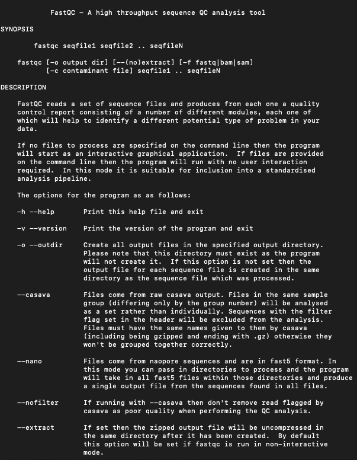
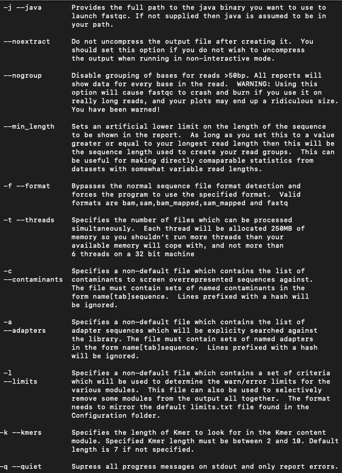
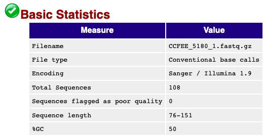
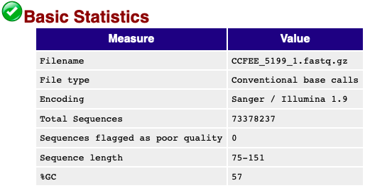
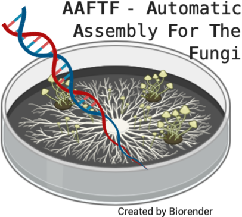

## You got your full genome sequencing results from Illumina, now what?
Usually Dr. Stajich has access and downloads this into the cluster under shared/projects/.

## 01-Let's run a diagnostic or FastQC on your reads

In order to tell if your sequence results were conclusive run the program FastQC.
Our HPCC/cluster has it saved as a module. So load it in with module load fastqc.

I always recommend running the help option for every new program you encounter this way you can see all the options available. 
Type in fastqc -h to view the multiple options this program has.


Make sure your files are in a proper folder. Create the folder `FastQC` in the same directory as your data. 
When I run FastQC on my samples I run it through these options.

```bash
fastqc XX_1.fastq.gz XX_2.fastq.gz --noextract -o FastQC  
```


All I've expressed here is - run fastqc on my forward run (1) and my reverse run (2), adding in --noextract allows my fastq.gz files to remain zipped.

We do this to conserve space, but also our assembly programs accept files in this format so there's no need to unzip them. 

My last step -o FastQC just directs my results into my `FastQC` folder, this way it is organized and away from the original data.

You can run this all on your directory or pass it through slurm. Though I've noticed the more you add in the script the more likely the code breaks.

As the code runs and finishes the files are created in `FastQC`. Direct yourself into the folder to observe the files.
Each read (forward and reverse) will have run separately and you will receive two files each (4 total). One being a zip file and the other an html file.

Find the suggestions on the HPCC webpage (http://hpcc.ucr.edu) on how to link your html files to your `.html` folder in your home page. 
That way you can open up your cluster onto an html link and view the report.

## 001-How to read your diagnostic results
You got some nice figures on your html link- what does it all mean?


My main focus is the top summary figure.



This is a bad quality read.



This one is much much better.

It gives you the total number of reads and that way you can see if the sequencing was successful or not. 
Look for checkmarks and see if your sequence lengths are good.
If you are curious there is a FastQC Manual (https://rtsf.natsci.msu.edu/genomics/tech-notes/fastqc-tutorial-and-faq/) to help clarify your concerns.


## 02- Create your samples.csv
What's this? It'll be the document you direct your script to look into. It'll have information you'll be needing to help assemble your genomes.
Basically you'll be creating a basic text file that describes your strains.

In Dr. Stajich's code he has a line that reads `sed -n ${N}p $SAMPLEFILE | while read BASE STRAIN PHYLUM`

What this line of code does is that it considers your `N`

(this will be the iteration your code is running in. If you've got more than one strain running it'll be run as an array, described more later)

Whatever number your array is on, it will consider that line of code. I.E. N = 1, will read the first line, etc.

-BASE = I consider the Genus and species name of your organism. If you're unsure of the species going for sp. is good too.

-STRAIN = Will be the short letter format of your reads. Usually it'll be in a format you sent to the company who did your sequencing. 

-PHYLUM = List the phylum of your strain!

Your document should look like this
```
Exophiala_xenobiotica,TK68,Ascomycete
Exophiala_xenobiotica,TK66,Ascomycete
```

..
Once complete it helps to do a quick `wc -l samples.csv` on your terminal to see how many lines this is. It will come in handy when you run them in an array. 

It's very important you take a look at Dr. Stajich's scripts and follow along that sed line. It'll help direct you on what your samples file should look like. 

## 03- Orienting your workspace
Make sure you have your directory all set up to do your assembly analysis. 

Have your Illumina sequence data in your `input/` folder.

Have your samples.csv file sitting in the main directory where your input folder lives.

Now let's create another folder - `logs`

This folder may sometimes be the reason your code doesn't run. Just mkdir `logs`

It is also really important to import the `augustus` folder to the same directory.

Augustus = /shared/pkg/augustus - you could symlink this to the same directory. ('ln -s /shared/pkg/augustus')

 ** Or if you're in another assembly folder worked on Dr. Stajich or others you can cp -r that folder to your directory.
 
 Finally you'll be creating your `pipeline` folder. It's best if you copy this entire folder from another worked through Assembly folder. (cp -r)
 
 ## 04- Let's Assemble!
 Dr. Stajich has played with different assemblers over the years. But his main brain child is the AAFTF wrapper. 
 *wrappers are code that helps put a bunch of other code together to be run sequentially.
 
 #AAFTF- Automatic Assembly For The Fungi - https://github.com/stajichlab/AAFTF 
 
 Steps are described below:
 
- AAFTF trim  Trim FASTQ input reads - with BBMap
- AAFTF filter  Filter contaminanting reads - with BBMap
- AAFTF assemble  Assemble reads - with SPAdes
- AAFTF vecscreen Vector and Contaminant Screening of assembled contigs - with BlastN based method to replicate NCBI screening
- AAFTF sourpurge Purge contigs based on sourmash results - with sourmash
- AAFTF rmdup Remove duplicate contigs - using minimap2 to find duplicates
- AAFTF pilon Polish contig sequences with Pilon - uses Pilon
- AAFTF sort  Sort contigs by length and rename FASTA headers
- AAFTF assess  Assess completeness of genome assembly
- AAFTF pipeline  Run AAFTF pipeline all in one go.
 

This is one script that I have been using that is the latest iteration of it. 
If you did not copy the pipeline folder from another directory- copy and paste this code into a empty txt file and call it 01_AAFTF.sh

---------
Script begins
---------

```bash
#!/usr/bin/bash
#SBATCH -N 1 -n 8 --mem 64gb --time 72:00:00 --out logs/AAFTF_new.%a.log
#above configurations are important for slurm. We're telling how much power and memory to use. How long to run (72 hours) and where to save the progress report (logs).

MEM=64
CPU=$SLURM_CPUS_ON_NODE
N=${SLURM_ARRAY_TASK_ID}

#This N is where the array comes into play. You'll be starting from the first line 1-(lastline)  

if [ -z $N ]; then
    N=$1
    if [ -z $N ]; then
        echo "Need an array id or cmdline val for the job"
        exit
    fi
fi

module load AAFTF

FASTQ=input
SAMPLEFILE=samples.csv
ASM=genomes
WORKDIR=working_AAFTF
#Dr. Stajich likes to save things into variables to be used later. We've mentioned that our FASTQ is the input folder where our reads are
#SAMPLEFILE is the file we just created
#ASM will be directed to genomes- this is where you will find your assembled genome, WORKDIR will be your temporary file directory.

mkdir -p $ASM $WORKDIR
#we're telling the script to create these two folders

if [ -z $CPU ]; then
    CPU=1
fi

# Notice this is my script and I've adjusted my sample file to have BASE, GENUS, SPECIES, ORDER, PHYLUM saved. If you use this script make sure you've accounted for this.
IFS=, # set the delimiter to be ,
sed -n ${N}p $SAMPLEFILE | while read BASE GENUS SPECIES ORDER PHYLUM
do
    ASMFILE=$ASM/${BASE}.${GENUS}.${SPECIES}.spades.fasta
    VECCLEAN=$ASM/${BASE}.${GENUS}.${SPECIES}.vecscreen.fasta
    PURGE=$ASM/${BASE}.${GENUS}.${SPECIES}.sourpurge.fasta
    CLEANDUP=$ASM/${BASE}.${GENUS}.${SPECIES}.rmdup.fasta
    PILON=$ASM/${BASE}.${GENUS}.${SPECIES}.pilon.fasta
    SORTED=$ASM/${BASE}.${GENUS}.${SPECIES}.sorted.fasta
    STATS=$ASM/${BASE}.${GENUS}.${SPECIES}.sorted.stats.txt
    LEFTIN=$FASTQ/${BASE}_1.fastq.gz
    RIGHTIN=$FASTQ/${BASE}_2.fastq.gz
    LEFTTRIM=$WORKDIR/${BASE}.${GENUS}.${SPECIES}_1P.fastq.gz
    RIGHTTRIM=$WORKDIR/${BASE}.${GENUS}.${SPECIES}_2P.fastq.gz
    LEFT=$WORKDIR/${BASE}.${GENUS}.${SPECIES}_filtered_1.fastq.gz
    RIGHT=$WORKDIR/${BASE}.${GENUS}.${SPECIES}_filtered_2.fastq.gz
    echo "$BASE $GENUS $SPECIES"
# We just created a bunch of variables, these will all be used below. A point for you to focus on is the LEFTIN and RIGHTIN variables.
# Sometimes your reads will be in XX_R1.fq.gz XX_R2.fq.gz
# Notice how different that is from XX_1.fastq.gz and XX_2.fastq.gz.  Make sure to look at your input files and see if these match- if not nano into it and change it.
# The rest of the script don't worry about it too much. As time goes on you can make more finer tuned suggestions.    
  
    if [ ! -f $ASMFILE ]; then # can skip we already have made an assembly
	if [ ! -f $LEFT ]; then # can skip filtering if this exists means already processed
	    if [ ! -f $LEFTTRIM ]; then
		AAFTF trim --method bbduk --memory $MEM --left $LEFTIN --right $RIGHTIN -c $CPU -o $WORKDIR/${BASE}.${GENUS}.${SPECIES}
	    fi
	    AAFTF filter -c $CPU --memory $MEM -o $WORKDIR/${BASE}.${GENUS}.${SPECIES} --left $LEFTTRIM --right $RIGHTTRIM --aligner bbduk
	    if [ -f $LEFT ]; then
		rm $LEFTTRIM $RIGHTTRIM # remove intermediate file
	    fi
	fi
	AAFTF assemble -c $CPU --left $LEFT --right $RIGHT  --memory $MEM \
	      -o $ASMFILE -w $WORKDIR/spades_${BASE}.${GENUS}.${SPECIES}
	
	if [ -s $ASMFILE ]; then
	    rm -rf $WORKDIR/spades_${BASE}.${GENUS}.${SPECIES}/K?? $WORKDIR/spades_${BASE}.${GENUS}.${SPECIES}/tmp
	fi
	
	if [ ! -f $ASMFILE ]; then
	    echo "SPADES must have failed, exiting"
	    exit
	fi
    fi
    
    if [ ! -f $VECCLEAN ]; then
	AAFTF vecscreen -i $ASMFILE -c $CPU -o $VECCLEAN
    fi
    if [ ! -f $PURGE ]; then
	AAFTF sourpurge -i $VECCLEAN -o $PURGE -c $CPU --phylum $PHYLUM --left $LEFT --right $RIGHT
    fi
    
        if [ ! -f $CLEANDUP ]; then
    	AAFTF rmdup -i $PURGE -o $CLEANDUP -c $CPU -m 500
        fi
    
        if [ ! -f $PILON ]; then
    	AAFTF pilon -i $CLEANDUP -o $PILON -c $CPU --left $LEFT  --right $RIGHT
        fi
    
        if [ ! -f $PILON ]; then
    	echo "Error running Pilon, did not create file. Exiting"
    	exit
        fi
    
    if [ ! -f $SORTED ]; then
	# AAFTF sort -i $PILON -o $SORTED
	AAFTF sort -i $VECCLEAN -o $SORTED
    fi
    
    if [ ! -f $STATS ]; then
	AAFTF assess -i $SORTED -r $STATS
    fi
done
```

...


Stop once you get to done and paste into your empty text file. 

To run this script make sure you are in your main directory you are working from.

What's does that look like now?

```
ls -l 
Should look like:
..augustus/
..input/
..logs/
..pipeline/
..samples.csv
```

You should see the above files. If you don't- Make sure you cd yourself here.
Now to run do:

`sbatch --array=1-(what was the total lines when you ran wc -l samples.csv?) pipeline/01_AAFTF.sh` (Hit ENTER)

An actual example:
`sbatch --array=1-25 pipeline/01_AAFTF.sh`

Running your script through an array allows multiple iterations of different data all at the same time. 

Check if your script is running ok with `squeue -u $YOURUSERNAME`

..

Good luck!

-T
