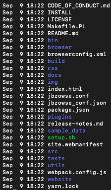
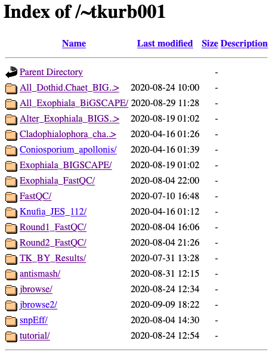

JBrowse - Genome Browser
=====

Written by: Tania Kurbessoian [@tania-k](https://github.com/tania-k)

To visualize genome annotation combined with Epigenomic, Transcriptomic, or Variant data you you want to visualize them onto a genome browser.  [JBrowse](https://jbrowse.org) provides an easy to setup tool for this visuzalition.

There is substantial [documentation](https://jbrowse.org/docs/installation.html) that describes installation and add-on features. The [FAQ](https://jbrowse.org/docs/faq.html) is also incredibly helpful. 

Setting up your own copy of Jbrowse software.
====

Use [git](https://git-scm.com/) to clone a copy of the software into `~/bigdata/` folder.  (20 seconds)
```
cd ~/bigdata
git clone https://github.com/gmod/jbrowse
```
Initially I had this jbrowse folder in my `~/.html/` directory but because on [HPCC](https://hpcc.ucr.edu) home directory is limited in space I made a symlink to the data folder in bigdata. So jbrowse folder is located in my `~/bigdata/` folder. Then from home I did the following to create the symlink.
```
cd  ~/.html/ 
ln -s ~/bigdata/jbrowse # this way I have more space to play with.
cd jbrowse 
git checkout 1.16.9-release # In the jbrowse folder checkout the specific release, later you can update this with a git pull and git checkout NEW-RELEASE
```

Setup "nodejs" conda environment
====

Basically configurations and packages to set up javascript environments.
If you don’t have this conda environment up yet, make sure to set it up with:
First create the environment-
```
conda create -n nodejs # create a new environment 
source activate nodejs # Then activate the newly created environment.
```

Install it from the bioconda or this case conda-forge.
```conda install -c conda-forge nodejs```

Load in python too
```
module load miniconda3
```
Now run the Jbrowse setup (this will take 10 minutes to run):
```
cd ~/.html/jbrowse
./setup.sh 
```
Running a quick ls -l on your path should show you this.



Check and see if the site has loaded on the HPCC hosted website. Here is my [cluster page - https://cluster.hpcc.ucr.edu/~tkurb001/](https://cluster.hpcc.ucr.edu/~tkurb001/)


Click on jbrowse2 to take you to the created page. This is my example run, your html link should be https://cluster.hpcc.ucr.edu/~YOURUSERNAME/ 

This will take a couple of seconds. It will say "Loading..." 
Once done it should say,   "Congratulations! Jbrowse is now on the web!"

Though you have no data loaded in so it’ll give you an error. You can look at the volvox dataset they have preinstalled. 
But now you can start setting up your own browser!

Now let’s set up the browser!
====

```
mkdir data # this is where all your files will live.
cd data 
ln -s /folder/to/your/genome.fasta # Symlink your annotated fasta file into your data folder.
module load samtools
samtools faidx genome.fasta # to create your indexed fasta file.
```
Now in order to have this appear on your browser you need to edit a file. Jbrowse gives you two options to edit an html file or just a text configuration file. 
```
trackList.json - html file
tracks.conf - text file
```

I just worked through the text file and not the json file because I wasn’t too familiar with the html structure. 
You can edit the text file through nano.

Add Reference Fasta File into your Browser
====

Now that you have your reference file and it’s indexed add this to your tracks.conf file. Replace my sequence names with yours. 
```
[GENERAL]
refSeqs=Exophiala_dermatitidis_Ex4.fa.fai

[tracks.refseq]
urlTemplate=Exophiala_dermatitidis_Ex4.fa
storeClass=JBrowse/Store/SeqFeature/IndexedFasta
type=Sequence
```

Add GFF3 file into your Browser
====
You can also add in a gff3 file. Add this to tracks.conf file
```
[tracks.genes]
urlTemplate=Exophiala_dermatitidis_Ex4.sorted.gff3.gz
storeClass=JBrowse/Store/SeqFeature/GFF3Tabix
type=CanvasFeatures
```

Add BAM files into your Browser
====
Let’s add in your BAM files. Again just symlink your BAM files from wherever they are into the data file. Unfortunately the cluster disallows the BAM files to appear on the browser due to a feature. A way to deactivate that is:

In your data file you should create the file `.htaccess.` 
It may be created on its own or you may have to create one yourself. If not add this into your .htaccess file.
```
nano .htaccess
# This Apache .htaccess file is generated by JBrowse (GenomeDB) for
# allowing cross-origin requests as defined by the Cross-Origin
# Resource Sharing working draft from the W3C
# (http://www.w3.org/TR/cors/).  In order for Apache to pay attention
# to this, it must have mod_headers enabled, and its AllowOverride
# configuration directive must allow FileInfo overrides.
<IfModule mod_headers.c>
    AddType application/octet-stream .bam .bami .bai
    Header onsuccess set Access-Control-Allow-Origin *
    Header onsuccess set Access-Control-Allow-Headers X-Requested-With,Range
    Header onsuccess set Access-Control-Expose-Headers Content-Length,Content-Range
</IfModule>
```

In order to get the bam files to appear on your browser add this to tracks.conf file. Make the adjustments to represent your data, and change the metadata description to your choosing.
```
[ tracks . EX1_bam ]
style.height = 7
key = BAM - Ex1-sorted.bam
storeClass = JBrowse/Store/SeqFeature/BAM
urlTemplate = Ex1.realign.sorted.bam
maxFeatureScreenDensity = 4
metadata.category = BAM
metadata.Description = BAM-format alignments of simulated resequencing reads on Ex1
type = JBrowse/View/Track/Alignments2
renderAlignment = true
```

If you have more than one file they should look like this:
```
[ tracks . EX2_bam ]
style.height = 7
key = BAM - Ex2-sorted.bam
storeClass = JBrowse/Store/SeqFeature/BAM
urlTemplate = Ex2.realign.sorted.bam            
maxFeatureScreenDensity = 4
metadata.category = BAM
metadata.Description = BAM-format alignments of simulated resequencing reads on Ex2                            
type = JBrowse/View/Track/Alignments2
renderAlignment = true
```
Add VCF files into your Browser
====
Follow the suggestions for your files, adjust the names and you’re good to go.
Now if you want to add vcf files, again symlink them into your data file. And add this to your tracks.conf file. 
```
[tracks. INDEL_VCF]
style.height = 7
storeClass=JBrowse/Store/SeqFeature/VCFTabix
urlTemplate=Exophiala.Run1.selected.INDEL.vcf.gz
maxFeatureScreenDensity = 4
metadata.category = VCF
type = JBrowse/View/Track/CanvasVariants
key = VCF - INDEL

[tracks.SNP_VCF]
style.height = 7
storeClass=JBrowse/Store/SeqFeature/VCFTabix
urlTemplate=Exophiala.Run1.selected.SNP.vcf.gz
maxFeatureScreenDensity	= 4
metadata.category = VCF
type = JBrowse/View/Track/CanvasVariants
key = VCF - SNPs
```

I’ve added a track for both SNPs and INDELs. If you’ve run Jason’s full GATK pipeline you’ll get these two files from snpEff. I’ve added the bgzip compressed files `Exophiala.Run1.selected.INDEL.vcf.gz` and `Exophiala.Run1.selected.SNP.vcf.gz`.

If you have `.vcf` files that are not compressed you can compress them with:
```
module load bcftools
bgzip FILE.vcf
```
 You should also index these files using:
```
module load bcftools
tabix -p vcf my_file.vcf.gz
```

I recommend you `chmod 755 data/` folder and also all the files that exist in the `data/` file (`chmod a+r data/*`)
Now refresh your page and your browser should appear!

If you would like to view my working browser go back to my html page with the different folders. Click on the `jbrowse` link to view my genome browser for Exophiala dermatitidis. 

Good luck!

-T
