# Creating A BioProject

BioProjects are summary records for individual or multiple genome, amplicon, or transcriptome datasets. BioProjects can also be organized as umbrella projects so that a single BioProject refers to multiple other bioprojects. Data can be assocated with a Bioproject like Samples, SRA records, Genomes, and Publications. BioSamples are individual project and can be organized 1:1 for a single strain genome and a single Bioproject. Or as a multi-sample project which can be multiple samples from the same species (population genomics) and in fact multiple species. A single biosample can also be associated with multiple BioProjects where appropriate.

One important aspect is __Locus Prefix__. Make sure you have checked that box as we will use that as part of annotation steps. If you forget to check this you can request it by email from ncbi curators - see the email at the bottom of the bioproject page for your record.

Generally I don't see a problem making a BioProject public right away, but some prefer to wait until they are ready to release their data publically. Generally you can embargo genome and SRA records even if a BioProject is public.

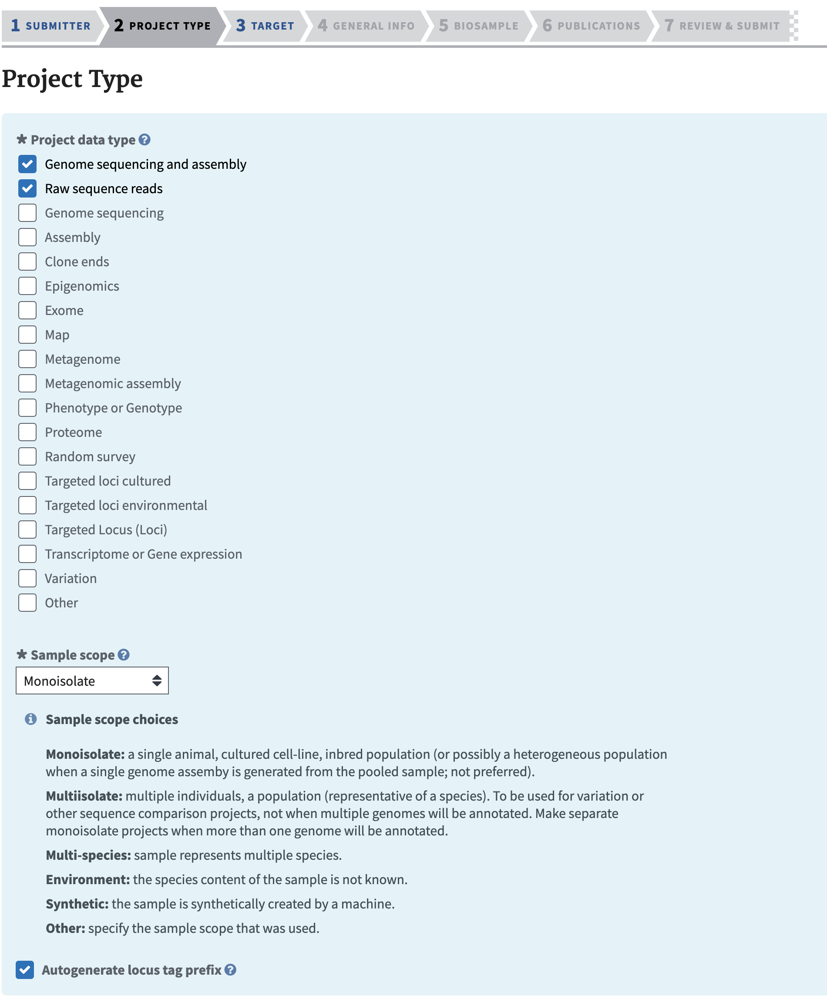

# Creating BioSamples

A BioSample record is needed for each biological sample of material that was used. For example a sample to represent the strain where DNA was prepared from. It is not necessary to make a separate biosample if the same strain was grown several times and sequenced more than once (eg a Nanopore and Illumina run). It is typical for labs using the same strain to still deposit a biosample for each of these to reflect there may be some evolution of strains throughout.  However for RNA sequencing or any other control/treatment experiments each sample will need a separate biosample in order to associate the conditions of the sample.

# Depositing data in NCBI

To deposit raw data from sequencing projects in NCBI SRA or from annotation and assembly projects we stage the data in an upload from [HPCC](https://hpcc.ucr.edu). You can also do direct uploads via NCBI web interface which will use aspera if you choose, however the data must then be local to your desktop/laptop.  To avoid copying the data first to your computer can simply direct upload these data from the cluster/linux machines where your analyses were are performed.

To stage data with an upload to the NCBI upload site we use a command line tool. It can be done with regular FTP upload.
However for larger dataset using [Aspera](https://www.ncbi.nlm.nih.gov/books/NBK242625/) is better as it is a faster upload mechanism which utilizes a parallel networking technology called [FASP](https://en.wikipedia.org/wiki/Fast_and_Secure_Protocol). It can achieve upload speeds 10-50x faster than typical single FTP upload speeds so for large Illumina datasets this is critical.

To do an upload you need to use  out your unique folder associated with your NCBI account you need to go to [NCBI submission] (https://submit.ncbi.nlm.nih.gov/subs/genome/) site and click on either the Aspera command line or FTP menu.
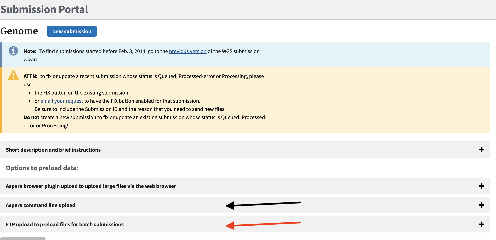

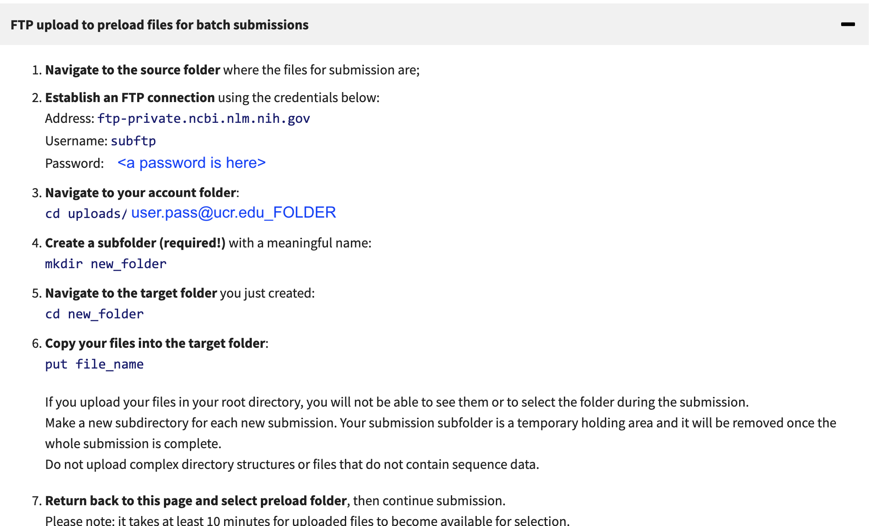

```
module load aspera
# (all one line)
ascp -i $ASPERAKEY -QT -l500m -k1
-d <path/to/folder/containing files/>
subasp@upload.ncbi.nlm.nih.gov:uploads/YOUREMAIL_XXXX/PRJYYY
```

Alternatively to use FTP you can use ftp client.
```
# lftp is easy and can be put in the background
lftp subftp@ftp-private.ncbi.nlm.nih.gov
password: <put in your password>
> cd uploads/UNIQUE_PATH_FROM_NCBI_PAGE
> mkdir PRJYYY
> cd PRJYY
> mput *.fastq.gz
```

These data are pulled in by the NCBI in the upload process, but it will take 10-15 minutes once you have uploaded the data. If you have datasets that are associated with different upload projects (eg Genome 1, Genome 2, Amplicon data set 2) make a folder for each genome dataset because during the submission upload you will select a folder to associate with a submit. I usually make a folder based on each Bioproject - so the upload folder name can be in the upload name (since it will have the bioproject name) `subasp@upload.ncbi.nlm.nih.gov:uploads/YOUREMAIL_XXXX/BIOPROJECTXX`.

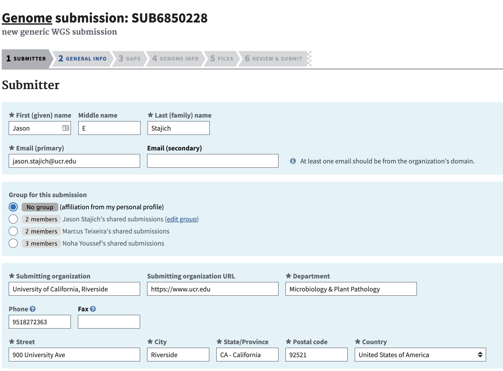

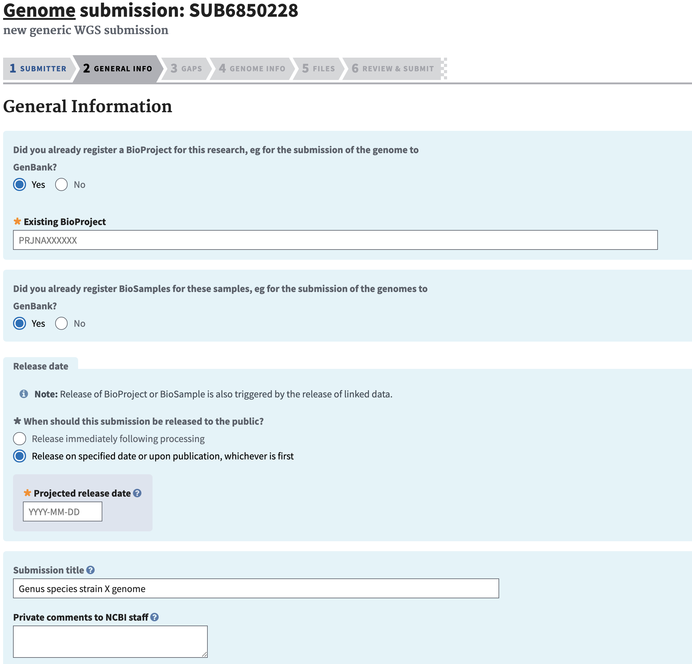

# SRA deposition

Amplicon data

## Raw DNA Sequence

Illumina data

PacBio and Nanopore

These are also similar to Illumina data deposition. Just FASTQ files can be desposited. However fast5 files are also deposited for Nanopore results.


## Raw RNA and Epigenomic data deposition

It is more typical to upload RNAseq data through the [Gene Expression Ombnibus](https://www.ncbi.nlm.nih.gov/geo/) (GEO). GEO will take uploaded raw data as well as computed gene expression data. It can also take ChIP-Seq Epigenomics

# Genome deposition

Genomes can be deposited as simply and assembly (FastA format) or an assembly with gene annotation (produced from a tool like funannotate). Annotated genomes in GenBank are usually deposited in the sequin format (`.sqn`). Typically a tool like funannotate will produce this already but it is generated from a simple annotation format called NCBI Table format (`.tbl`) and a genome assembly Fasta file. The `.tbl + .fsa` files are combined in a tool called `tbl2asn` which produces the `.sqn` file and does a bunch of checking for everything from frame shifts to ensuring gene/mRNA/exon features all overlap as expected in their ranges, and many more checks.

The first page for genome submission is the [submit.ncbi.nih.gov](http://submit.ncbi.nih.gov).
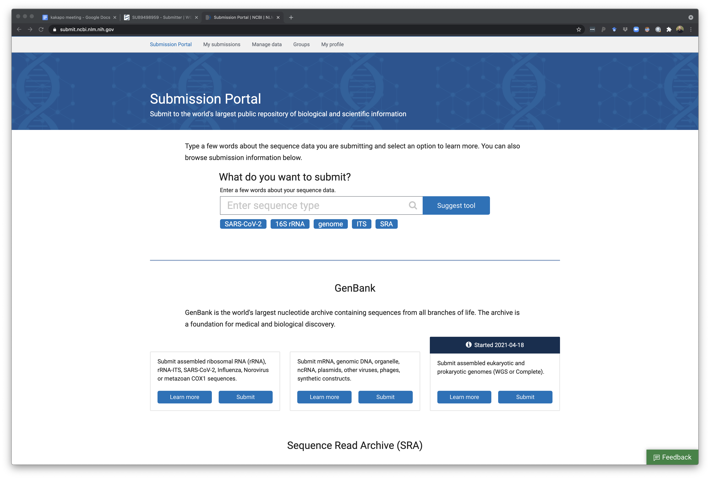

Select a GenBank WGS genome submission to begin a new submission or continue an existing one. Once you have entered there you can choose to start a new submission 'New submission' button or click on an unfinished/in-progress one if you started something and need to come back.

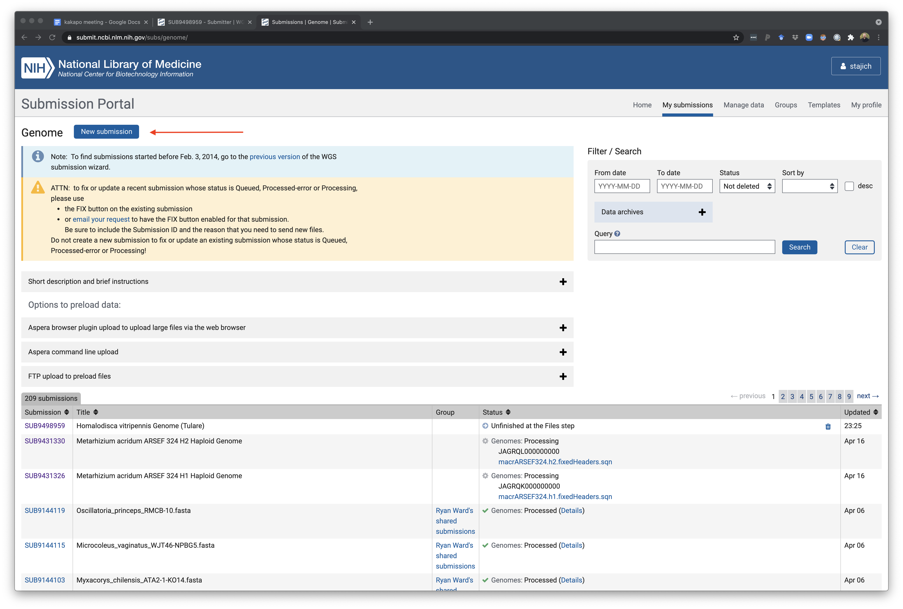

The next page is where the primary submitted info is included. This could be a group account for a lab or an individual. There are ways to also create group-shared submission teams if you want to give permission to your other collaborators. Weirdly you can only make one of these groups for yourself but you can be part of many other ones.  It may be important if you will be leaving the lab at some point to make sure to specify that your PI has permission to update any genome record so that fixes and updates can be applied to a genome.

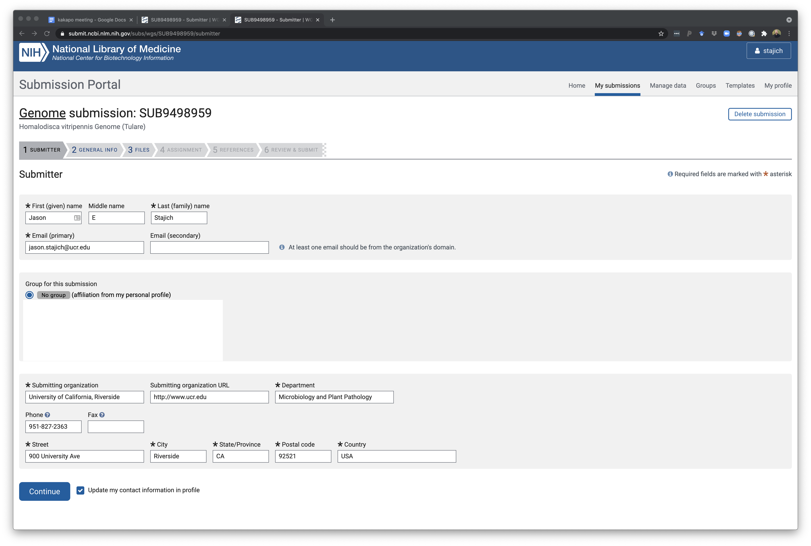

The next page will require of entry about this project and genome including the BioProject and BioSample associated with the record. You will also need to have already created a BioProject and BioSample for this genome. You should also plan to deposit the raw sequence reads in the SRA but you can do that after the genome is deposited.

This example is for a single genome - there are options to do a bulk upload if you have a raft of genomes to put up as part of a single project. This requires some communication with NCBI as there can only be a single BioProject in the upload step but there is a way to provide NCBI curators with a table that links genome to BioProject as well.

But this example is just for a single genome deposition. You can specify a release for the genome - it can be immediately or a specified date in the future.  However if you set a  date you can easily come in and change it to a different later or earlier date in the system. NCBI also typically emails the primary submitted a few days before an embargo is expiring in case you need to ask for additional time (they typically do this in increments of 6 months I believe).
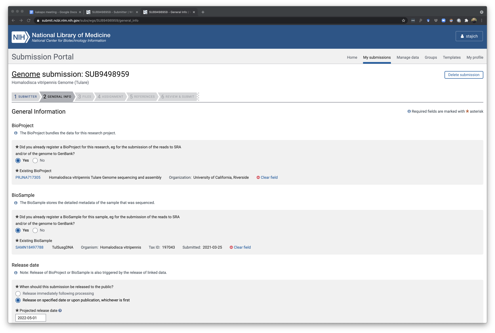

The next part of this same page is where assembly info is also recorded. You'll need to know how your assembly was constructed and what assembly tools and dates or version of the tools.

Depth of coverage of a genome calculated from total read amount and genome assembly size (bbcount or calculating this in mosdepth if you have a bam/cram file for your datasets aligned back to the genome).

Here's an example of calculating depth of coverage
```
module load mospdeth
mosdepth -x -n -t 16 remap_results Genome_remapped_reads.bam
```
and then run this R code to compute the mean depth of coverage. You can also add some additional filtering steps if you want to remove high coverage contigs from the average calculation, etc.

```R
library(dplyr)
mosd <- read.csv("remap_results.mosdepth.summary.txt",sep="\t",header=T)

mean(mosd$mean)
summary(mosd)
# remove high coverage for example using 100x as the cutoff in this example
nohighcov <- r %>% filter(mean < 100)
mean(nohighcov$mean)
summary(nohighcov)

```
This will give you a readout of the average depth of coverage across the contigs/chromosomes so you can fill in a number for depth of coverage in the genome submission entry.

Additional tools to calculate this include bbmap.sh
```bash
#SBATCH -p short -N 1 -n 48 --mem 64gb --out bbmap.log
module load BBMap
MEM=64
bbmap.sh -Xmx${MEM}g ref=GENOME.fasta in=LEFTREADS.fastq.gz in2=RIGHTREADS.fastq.gz statsfile=remapped_reads.bbmap_summary.txt
```

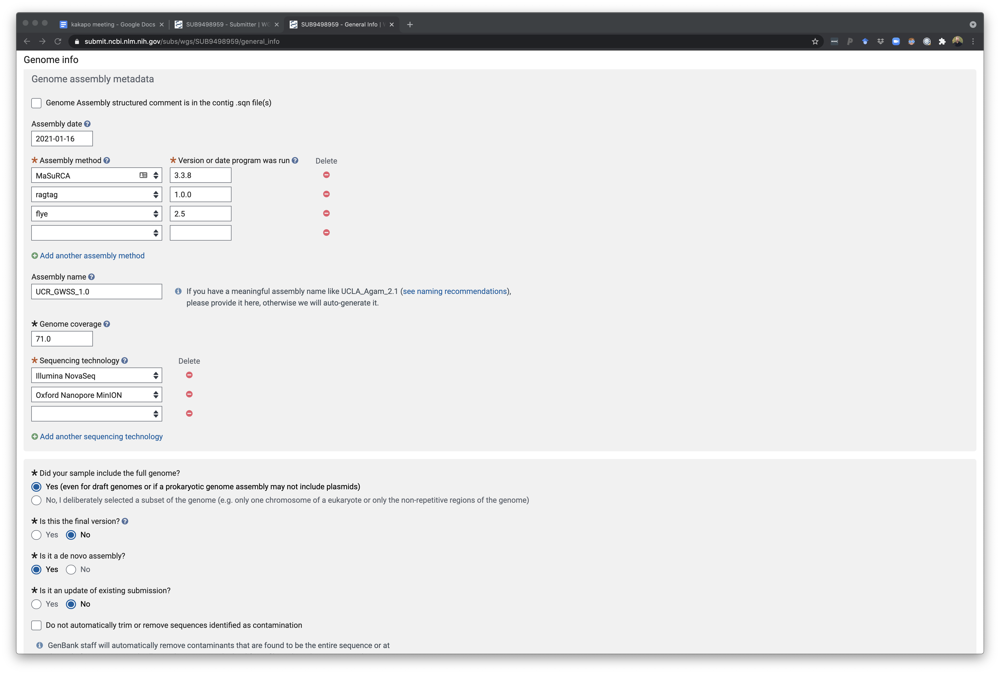

The bottom of this page finall shows the rest of the questions which also allow you to specify a short description of this so you can easily remember which project this is for. In addition you can provide comments for NCBI curators as they check the deposition.  There is an option to let NCBI remove any vector contamination from the assembly for you - this is usually something you will have tried to do before. However in some cases, a workflow is to generate a genome assembly and do test deposit of a genome and allow NCBI to find and remove vector sequence. Using this cleaned assembly you can then run annotation pipeline and then submit this annotation as an update to this genome later on. I have not done this routinely but it has some value. We have tried to implement local vector and contamination cleanup as part of [AAFTF](http://github.com/stajichlab/AAFTF) but it still misses a few things NCBI detects and may need an update.

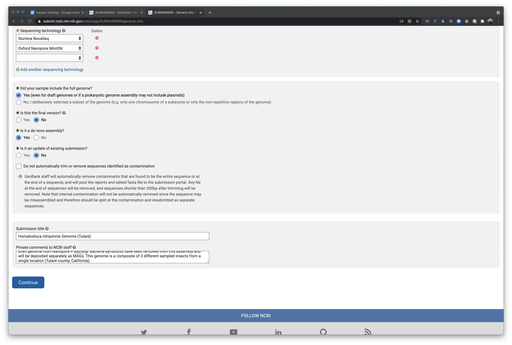

This page is for telling NCBI if the genome is completely assembly or still in fragements. Using this page you can upload genome files directly via your browser or follow directions on how to upload on the command line.

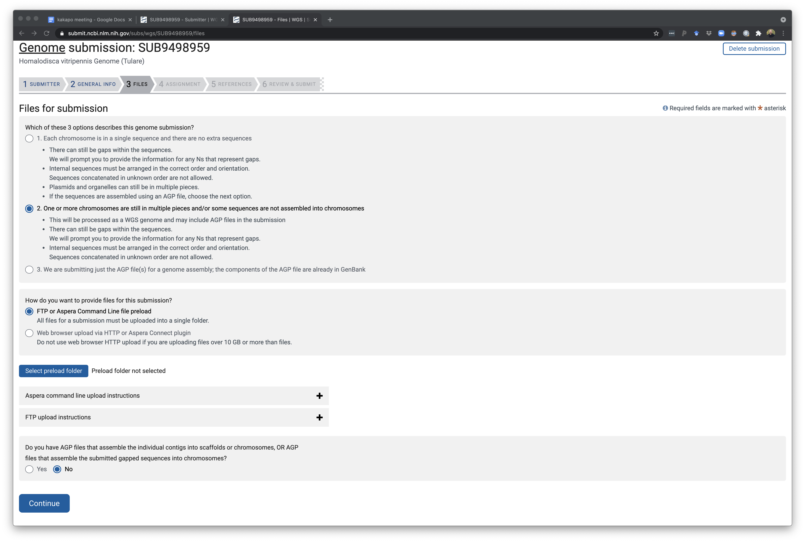

### Uploading Genome data

The one, or many if you have a large genome the .sqn file will be split up by funannotate, sqn file(s) need to be uploaded to NCBI via either FTP or aspera. Aspera commands as shown before include a key that comes with aspera command line tool install as well as a private folder name for your account on NCBI which you can reveal in the Aspera command line instructions section of the page.

The upload step will look something like this on the UCR HPCC where *YOUREMAIL_SECRETFOLDER* will be what NCBI assigned to your account.

```
module load aspera
ascp -i $ASPERAKEY -QT -l 300m -k1 -d ./*.sqn subasp@upload.ncbi.nlm.nih.gov:uploads/YOUREMAIL_SECRETFOLDER/A_UNIQUE_NAME_FOLDER/
```
You specify a folder name (`A_UNIQUE_NAME_FOLDER`) for a particular project upload.

## When you get an error on your genome assembly upload
As you attempt to submit assemblies of genomes into NCBI, you might get some errors about contamination. Even though the AAFTF pipeline has a vecscreen where contaminated contigs are screened out, there are still some that get left over. NCBI has really strict rules for this.


Once you submit the assemblies you will get some errors you need to "fix". Before submitting you will get the option to have NCBI clear out the contamination or you can not toggle this button, which will prompt you to clear out your own assemblies.

When prompted to fix your genomes, you may get a series of options. "Remaining Contamination" or "Contamination" text files.
Opening this file you'll see regions to "Trim" and regions to "Exclude".

Here are some tips to get rid of each.
The scaffolds to exclude will require removing entire scaffolds.
try Jason's scripts:

Git Clone this repo into the folder you want to do your cleaning.
```
git clone https://github.com/hyphaltip/autovectorscreen
```

Right click and copy address of each txt file in your "Fix" page. Paste the txt file into your page. You'll probably have to rename it from index.html to the full name.

```
wget remainingcontamination_exophiala_dermatitidis_ex12.txt
```
Once done, move your old scaffold file to the same directory
mv Exophiala_dermatitidis_Ex4.sorted.fasta path/to/working/directory/

now run the program autovectorscreen.

```
python autovectorscreen/scripts/clean_ncbi_tagged.py Exophiala_dermatitidis_Ex4.sorted.fasta remainingcontamination_exophiala_dermatitidis_ex12.txt
```

This will generate a log file and a new fasta file where it removed regions (either trim or exclude). Rename this file and move it back into your annotation pipeline.
Redo analysis and generate new files to deposit.
Repeat as necessary, for some reason NCBI doesn't give you all the errors in the beginning and may give you pieces of mitochondrial data and others every round.

### NCBI Foreign Contamination Screening

This NCBI screening can be run manually before processing your genome. It is best to do this before you start annotation in case any contigs needs to be broken up due to a false join by a vector sequence or to remove other sequence contamination. This can be run locally using the NCBI FCS tools.

These are available to run https://github.com/ncbi/fcs. The vector screening can run quickly without a large database (must be run through a docker or singularity instance). However the cross-species comparison (FCS-GX) requires a large database to be downloaded and a large memory instance for it to run. This is not currently configured on [HPCC](https://hpcc.ucr.edu) but when available instructions will be provided.  


## Annotated Bacteria genomes

For Bacteria there is a simple way to get these annotations and genome deposited in one go. Simply use the [PGAP](https://www.ncbi.nlm.nih.gov/genome/annotation_prok/) procedure.  The Genome submission portal is still used for uploading but then an option to annotate

If you would like to annotate a genome with PGAP before depositing you can also download and run [PGAP locally](https://github.com/ncbi/pgap).

# Assembled Transcriptomes

Use the Transcriptome Sequence Archive (TSA). These will still require a minimum length sequence filtering and will potentially trigger vector or contamination that will require removal of some sequences based on cross-contamination or vector sequence.

# Assembled Metagenomes or Metatranscriptomes

Assembled metagenomes can be deposited as well through the NCBI submission interface.  These will need a biosample that is derived from a metagenome taxonomic id. For example see one of our [Antarctic rock metagenomes: JAABUH000000000](https://www.ncbi.nlm.nih.gov/nuccore/JAABUH000000000) which has the biosample [SAMN10711871)](https://www.ncbi.nlm.nih.gov/biosample/SAMN10711871) and this sample has the taxonomy ID ["rock metagenome"](https://www.ncbi.nlm.nih.gov/taxonomy/1311626) as [1311626](https://www.ncbi.nlm.nih.gov/Taxonomy/Browser/wwwtax.cgi?id=1311626).

These will be screened for vector or adaptor contamination and may trigger cleanup steps but it will not screen for cross-species contamination since it is a metagenome.

# Metagenome-assembled genomes

Instructions are [here](https://www.ncbi.nlm.nih.gov/genbank/wgsfaq/#metagen). First, create a BioProject and then create a Biosample for any host or environmental 'metagenome' samples of origin (the "physical" biosamples) as decribed above. Next email genomes@ncbi.nlm.nih.gov with a list of proposed taxonomic names for each MAG at its lowest rank for NCBI to review.

> Here are the MAG names I sent to NCBI for consideration:
> * Wolbachia sp.
> * Candidatus Baumannia cicadellinicola  
> * Candidatus Sulcia muelleri


> They sent back:
> * Wolbachia endosymbiont of Homalodisca vitripennis
> * Candidatus Baumannia cicadellinicola
> * Candidatus Sulcia muelleri

Use the NCBI provide names for MAGs to now create "organism"-specific biosamples. When creating the biosamples, choose "MIMAG Metagenome-assembled Genome". Include the BioProject ID made earlier during submission. Any Bin IDs can be included as the isolate name. Finally add a custom attribute 'derived-from' and add 'This BioSample is a metagenomic assembly obtained from the host XXXXXXXXXX BioSample: SAMNXXXXX.' to connect the MAG back to the physical biosample(s). If you've used a combined assembly (or co-assembly) approach, then instead here you will list all BioSamples such that 'This BioSample is a metagenomic assembly obtained from the metagenome BioSamples: SAMNXXX, SAMNXXX, and SAMNXXX.' You could also add custom attributes at this stage of % completion and % contamination for your MAGs.

Finally, the MAGs can now be deposited via the WGS submision portal as genome assemblies (as described above) using the BioProject ID that we made earlier and the organism-specific BioSample IDs for each of the MAGs. For unannotated archaeal/bacterial MAGs, you only need a fasta file to submit these to NCBI. At the end of the submission process, you will be asked if you want to use NCBI's in-house annotation tool to annotate these, PGAP (as described above). Alternatively, you can provide .sqn files with your own annotation during deposition.

Note - if you have a co-assembly you plan to deposit, in addition to "physical" and "organism" biosamples, you will also need to create a single BioSample that represents the 'combination of physical samples', SAMNXXX-SAMNXXX and include a note indicating that its a co-assembly such that 'This sample group is the combination of the XX individual BioSamples:AMNXXX, SAMNXXX, and SAMNXXX.' Then proceed as follows for a WGS submission.
